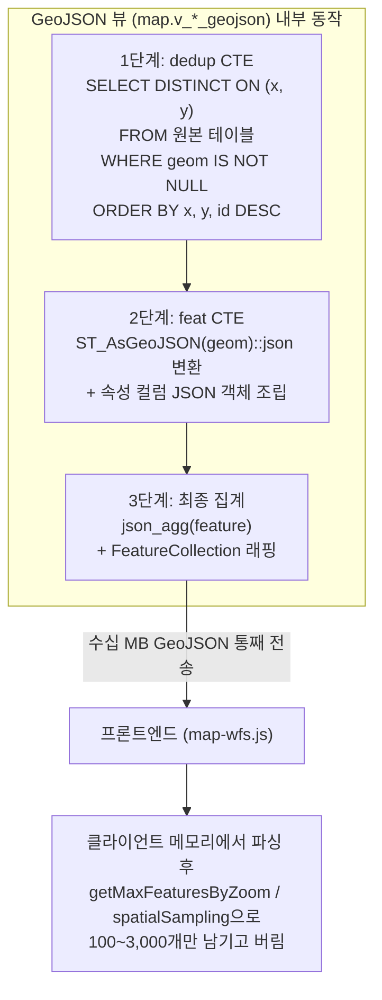

# sjlab 개발 DB 상세 성능·품질 분석 보고서

- **문서 위치**: `docs/analysis/db-analysis.md`
- **분석 대상**: PostgreSQL 17.0 + PostGIS 3.4.3 개발 데이터베이스 (`sjlab`)
- **접속 환경**: `mcp_readonly` (읽기 전용 계정, `default_transaction_read_only = on`)
- **기준 참조**: 기본 연결 및 권한 현황은 [sjlab-dev-db-check.md](sjlab-dev-db-check.md) 참조
- **프론트엔드 연동 참조**: [map-wfs.js](file:///C:/vscode_develop/sj-lab-mapservice/js/modules/map/map-wfs.js) (`getMaxFeaturesByZoom`, `spatialSampling`)
- **분석 원칙**: 모든 쿼리는 `BEGIN READ ONLY` 및 `SET statement_timeout = '60s'` 환경에서 수행되었으며, `EXPLAIN ANALYZE` 없이 정적 `EXPLAIN` 및 카탈로그 통계만 활용함. 보안 비밀값(비밀번호, 호스트 IP)은 일절 기재하지 않음.

---

## 1. 인덱스 및 저장공간 분석

### 1.1 대상 테이블 전체 인덱스 및 제약조건 현황
분석 대상 테이블 10개(POI 6종, 버스 노선 1종, 행정구역 경계 3종)의 인덱스 목록(`pg_indexes`), 기본키 및 유니크 제약조건(`pg_constraint`), 공간 인덱스(GIST) 현황입니다.

> **실행 쿼리 요지**:
> ```sql
> -- 인덱스 목록 조회
> SELECT schemaname, tablename, indexname, indexdef FROM pg_indexes
> WHERE (schemaname = 'map' AND tablename IN ('convenience_store','bus_stop_info','cctv_info','pharmacy','hospital','government_office','bus_route_info'))
>    OR (schemaname = 'public' AND tablename IN ('g_sido','g_sgg','g_emd'));
> 
> -- GIST 공간 인덱스 및 제약조건 확인
> SELECT conrelid::regclass, conname, contype, pg_get_constraintdef(oid) FROM pg_constraint
> WHERE conrelid IN ('map.convenience_store'::regclass, ...);
> ```

| 스키마 | 테이블명 | 인덱스 수 | 기본키 (PK) | 유니크 제약 (UQ) | `geom` GIST 공간 인덱스 | 인덱스 상세 목록 |
|---|---|:---:|---|---|:---:|---|
| `map` | `convenience_store` | 7개 | `objt_id` | - | **보유** (`idx_convenience_store_geom`) | `convenience_store_pkey` (PK), `idx_convenience_store_geom` (GIST), `convenience_store_x_idx` (x), `convenience_store_y_idx` (y), `convenience_store_fclty_nm_idx` (fclty_nm), `convenience_store_adres_idx` (adres), `convenience_store_rn_adres_idx` (rn_adres) |
| `map` | `bus_stop_info` | 3개 | `id` | `stop_code` | **보유** (`ix_bus_stop_info_geom_gist`) | `bus_stop_info_pkey` (PK), `uq_bus_stop_info_stop_code` (UQ), `ix_bus_stop_info_geom_gist` (GIST) |
| `map` | `cctv_info` | 3개 | `id` | - | **보유** (`ix_cctv_info_geom_gist`) | `cctv_info_pkey` (PK), `ix_cctv_info_geom_gist` (GIST), `ix_cctv_info_road_section` (road_section_id) |
| `map` | `pharmacy` | 7개 | `id` | `hpid` | **보유** (`idx_pharmacy_geom`) | `pharmacy_pkey` (PK), `pharmacy_hpid_unique` (UQ), `idx_pharmacy_geom` (GIST), `idx_pharmacy_location` (wgs84_lat, wgs84_lon), `idx_pharmacy_duty_name` (duty_name), `idx_pharmacy_hpid` (hpid), `idx_pharmacy_collected_on` (collected_on) |
| `map` | `hospital` | 8개 | `id` | `hpid` | **보유** (`idx_hospital_geom`) | `hospital_pkey` (PK), `hospital_hpid_unique` (UQ), `idx_hospital_geom` (GIST), `idx_hospital_location` (wgs84_lat, wgs84_lon), `idx_hospital_duty_name` (duty_name), `idx_hospital_duty_div_nam` (duty_div_nam), `idx_hospital_hpid` (hpid), `idx_hospital_collected_on` (collected_on) |
| `map` | `government_office` | 9개 | `id` | - | **보유** (`idx_government_office_geom`) | `government_office_pkey` (PK), `idx_government_office_geom` (GIST), `idx_government_office_location` (x_coord, y_coord), `idx_government_office_objt_id` (objt_id), `idx_government_office_fclty_nm` (fclty_nm), `idx_government_office_fclty_ty` (fclty_ty), `idx_government_office_fclty_cd` (fclty_cd), `idx_government_office_ctprvn_cd` (ctprvn_cd), `idx_government_office_sgg_cd` (sgg_cd) |
| `map` | `bus_route_info` | 4개 | `seq` | `route_id` | N/A (공간컬럼 없음) | `bus_route_info_pkey` (PK), `uq_bus_route_info_route_id` (UQ), `idx_bus_route_info_route_no` (route_no), `idx_bus_route_info_route_tp` (route_tp) |
| `public` | `g_sido` | 1개 | `sido_cd` | - | **미보유 (누락)** | `sido_cd_pk` (PK, btree sido_cd) |
| `public` | `g_sgg` | 2개 | `sgg_cd` | - | **보유** (`g_sgg_geom_idx`) | `g_sgg_pkey` (PK), `g_sgg_geom_idx` (GIST) |
| `public` | `g_emd` | 2개 | `emd_cd` | - | **보유** (`g_emd_geom_idx`) | `g_emd_pkey` (PK), `g_emd_geom_idx` (GIST) |

---

### 1.2 테이블·인덱스·TOAST 용량 분석
각 테이블별 실측 저장공간(`pg_relation_size`, `pg_indexes_size`, `pg_total_relation_size`) 및 행 수 현황입니다.

> **실행 쿼리 요지**:
> ```sql
> SELECT
>     n.nspname AS schema_name, c.relname AS table_name, c.reltuples::bigint AS est_rows,
>     pg_size_pretty(pg_relation_size(c.oid)) AS table_size,
>     pg_size_pretty(pg_indexes_size(c.oid)) AS index_size,
>     pg_size_pretty(COALESCE(pg_total_relation_size(c.reltoastrelid), 0)) AS toast_size,
>     pg_size_pretty(pg_total_relation_size(c.oid)) AS total_size
> FROM pg_class c JOIN pg_namespace n ON n.oid = c.relnamespace
> WHERE (n.nspname = 'map' AND c.relname IN ('convenience_store','bus_stop_info','cctv_info','pharmacy','hospital','government_office','bus_route_info'))
>    OR (n.nspname = 'public' AND c.relname IN ('g_sido','g_sgg','g_emd'))
> ORDER BY pg_total_relation_size(c.oid) DESC;
> ```

| 순위 | 스키마 | 테이블명 | 행 수 (`reltuples`) | 테이블 크기 | 인덱스 크기 | TOAST 크기 | 전체 크기 (`total_size`) | 비고 |
|---:|---|---|---:|---:|---:|---:|---:|---|
| 1 | `map` | `convenience_store` | 56,193 | 35 MB | 41 MB | 8 kB | **76 MB** | 인덱스 용량이 테이블 본체보다 큼 |
| 2 | `public` | `g_emd` | 5,061 | 15 MB | 448 kB | 45 MB | **60 MB** | 복잡한 읍면동 다각형 경계로 TOAST 비중 큼 |
| 3 | `map` | `bus_stop_info` | 206,018 | 36 MB | 23 MB | 8 kB | **59 MB** | 전국 정류장 단일 최대 행 수 (20.6만건) |
| 4 | `map` | `hospital` | 77,940 | 26 MB | 19 MB | 8 kB | **46 MB** | 진료시간 등 상세 속성 보유 |
| 5 | `public` | `g_sgg` | 252 | 40 kB | 24 kB | 21 MB | **21 MB** | 시군구 경계 다각형 TOAST 저장 |
| 6 | `public` | `g_sido` | 17 | 8 kB | 16 kB | 13 MB | **13 MB** | 시도 광역 경계 다각형 TOAST 저장 |
| 7 | `map` | `pharmacy` | 24,920 | 7,336 kB | 5,592 kB | 8 kB | **13 MB** | 전국 약국 위치 및 영업시간 정보 |
| 8 | `map` | `cctv_info` | 12,493 | 7,272 kB | 1,784 kB | 8 kB | **9,096 kB** | 스트리밍 URL 등 텍스트 정보 포함 |
| 9 | `map` | `bus_route_info` | 20,077 | 3,272 kB | 2,160 kB | 8 kB | **5,472 kB** | 버스 노선 마스터 |
| 10 | `map` | `government_office` | 9,363 | 2,192 kB | 2,216 kB | 8 kB | **4,448 kB** | 전국 관공서 위치 및 분류 정보 |
| - | `ai` | `apt_rents` (참조) | 12,022,802 | 2,602 MB | 484 MB | 8 kB | **3,086 MB** | 카탈로그 통계만 조회 (전체 스캔 차단) |
| - | `ai` | `apt_trades` (참조) | 10,749,853 | 2,289 MB | 498 MB | 8 kB | **2,788 MB** | 카탈로그 통계만 조회 (전체 스캔 차단) |

---

### 1.3 누락 인덱스 및 비효율 인덱스 구조 분석
1. **`public.g_sido`의 GIST 공간 인덱스 누락**:
   - `g_sgg`와 `g_emd`에는 각각 `g_sgg_geom_idx`, `g_emd_geom_idx`가 존재하지만, 전국 17개 시도 경계를 담은 `g_sido`에는 `geom` 컬럼 GIST 인덱스가 없습니다. 시도 단위 공간 교차(`ST_Intersects`)나 포함 관계 쿼리 시 불필요한 전체 지오메트리 계산이 발생합니다.
2. **B-Tree 인덱스 컬럼 순서 역전 문제 (`hospital`, `pharmacy`)**:
   - `map.hospital`과 `map.pharmacy`의 좌표 인덱스(`idx_hospital_location`, `idx_pharmacy_location`)는 `(wgs84_lat, wgs84_lon)` 순서로 생성되어 있습니다.
   - 반면 해당 뷰(`v_hospital_info_geojson`, `v_pharmacy_info_geojson`)의 정렬 및 중복제거 절은 `ORDER BY wgs84_lon, wgs84_lat` 순서입니다.
   - B-Tree 인덱스는 선행 컬럼이 일치해야 정렬 최적화가 가능하므로, **컬럼 순서 불일치로 인해 인덱스를 전혀 타지 못하고 전체 테이블 메모리/디스크 정렬(Sort)을 수행**합니다.
3. **단일 컬럼 인덱스로 인한 복합 정렬 미지원 (`convenience_store`, `bus_stop_info`, `cctv_info`)**:
   - `map.convenience_store`: `x`와 `y`에 대해 개별 단일 인덱스(`convenience_store_x_idx`, `convenience_store_y_idx`)만 존재하여, `ORDER BY x, y` 정렬을 지원하지 못합니다.
   - `map.bus_stop_info`: 20.6만 건의 대형 테이블임에도 `(lon, lat)` B-Tree 인덱스가 전무하여 전체 20.6만 건을 매 뷰 호출마다 통째로 정렬합니다.
   - `map.cctv_info`: `(coordx, coordy)` B-Tree 인덱스가 전무합니다.
4. **중복(Duplicate) B-Tree 인덱스 낭비**:
   - `map.hospital`: `hospital_hpid_unique` (UNIQUE btree on `hpid`)가 이미 존재함에도 불구하고 `idx_hospital_hpid` (btree on `hpid`)가 별도로 이중 생성되어 약 2.5MB의 디스크와 인덱스 버퍼를 낭비하고 있습니다.
   - `map.pharmacy`: `pharmacy_hpid_unique`와 `idx_pharmacy_hpid`가 동일하게 이중 생성되어 있습니다.

---

## 2. GeoJSON 뷰 구조 및 실행계획 분석

### 2.1 GeoJSON 뷰 정의 분석 (`pg_get_viewdef`)
프론트엔드가 호출하는 백엔드 엔드포인트에 직결된 6개 GeoJSON 뷰(`map.v_*_geojson`)의 정의 구조는 모두 동일한 3단계 CTE 패턴으로 구성되어 있습니다.

> **실행 쿼리 요지**:
> ```sql
> SELECT table_name, pg_get_viewdef(('map.' || table_name)::regclass, true) AS viewdef
> FROM information_schema.views
> WHERE table_schema = 'map' AND table_name LIKE 'v_%_geojson';
> ```



- **공통 정의 패턴**:
  1. `WITH dedup AS (SELECT DISTINCT ON (<coord1>, <coord2>) ... WHERE geom IS NOT NULL ORDER BY <coord1>, <coord2>, id DESC)`
  2. `feat AS (SELECT json_build_object('type', 'Feature', 'id', 'map:<table>.' || id, 'geometry', st_asgeojson(geom)::json, 'properties', json_build_object(...)) FROM dedup)`
  3. `SELECT json_build_object('type', 'FeatureCollection', 'features', COALESCE(json_agg(feature), '[]'::json)) AS geojson FROM feat;`

---

### 2.2 EXPLAIN 정적 실행계획 및 예상 비용 비교
`EXPLAIN (FORMAT TEXT) SELECT * FROM map.v_*_geojson;`을 통해 측정한 각 뷰의 스캔 방식, 정렬 방식, 예상 비용 분석 결과입니다.

| 뷰 이름 | 대상 테이블 | 추정 행수 | 스캔 방식 | 정렬(Sort) 방식 | 예상 비용 (`cost`) | 비고 |
|---|---|---:|---|---|---:|---|
| `map.v_bus_stop_info_geojson` | `bus_stop_info` | 206,018 | **Seq Scan** | Sort (CPU 메모리 정렬) | **147,587.38** | JIT 활성화, 최악의 단일 쿼리 비용 |
| `map.v_hospital_info_geojson` | `hospital` | 78,567 | **Parallel Seq Scan** (2 Workers) | Parallel Sort + Gather Merge | **57,833.23** | 인덱스 순서 불일치로 병렬 시퀀셜 스캔 강제 |
| `map.v_convenience_store_geojson` | `convenience_store` | 56,193 | **Seq Scan** | Sort (CPU 메모리 정렬) | **44,863.19** | 단일 B-Tree 인덱스로 복합 정렬 불가 |
| `map.v_pharmacy_info_geojson` | `pharmacy` | 25,308 | **Seq Scan** | Sort (CPU 메모리 정렬) | **22,139.69** | 인덱스 순서 불일치로 풀 스캔 |
| `map.v_cctv_info_geojson` | `cctv_info` | 12,493 | **Seq Scan** | Sort (CPU 메모리 정렬) | **9,624.19** | 좌표 인덱스 부재로 풀 스캔 |
| `map.v_government_office_geojson` | `government_office` | 9,363 | **Index Scan** (`idx_government_office_location`) | Incremental Sort | **7,776.61** | 유일하게 좌표 복합 인덱스 활용 |

- **세부 플랜 관찰 결과**:
  - 6개 뷰 중 5개 뷰(`bus_stop`, `hospital`, `convenience_store`, `pharmacy`, `cctv`)가 **전체 행을 대상으로 Seq Scan**을 수행한 후 고비용 `Sort` -> `Unique` -> `Aggregate` 단계를 거칩니다.
  - `map.v_government_office_geojson`만 유일하게 `idx_government_office_location (x_coord, y_coord)` 인덱스를 활용하여 `Incremental Sort`를 수행하므로 비용이 가장 낮습니다.

---

### 2.3 프론트엔드 아키텍처와의 근본적 불일치 분석
프론트엔드 코드([map-wfs.js:127-160, 680-740](file:///C:/vscode_develop/sj-lab-mapservice/js/modules/map/map-wfs.js))와 현재 DB 뷰 설계는 다음과 같은 심각한 아키텍처적 불일치를 지니고 있습니다.

1. **원샷 전건 전송 vs 클라이언트단 줌/뷰포트 필터링**:
   - 프론트엔드는 지도 줌 레벨에 따라 표출 개수를 제한합니다:
     - 줌 ≥ 18: 최대 3,000개
     - 줌 16~17: 최대 1,500개
     - 줌 14~15: 최대 800개
     - 줌 12~13: 최대 400개
     - 줌 10~11: 최대 200개
     - 줌 < 10: 최대 100개
   - 정작 브라우저가 화면에 표시하는 개수는 **100개 ~ 3,000개에 불과**함에도, DB 뷰는 전국의 206,018개 정류장, 78,567개 병원 데이터를 단 하나의 거대한 단일 GeoJSON 문자열(수십 MB)로 만들어 네트워크로 전송합니다.
   - 브라우저는 수십 MB를 다운로드받은 뒤 메인 스레드에서 전체 JSON을 역직렬화(`JSON.parse`)하고, `spatialSampling` 함수로 대부분의 데이터를 버립니다. 이로 인해 초기 레이어 토글 시 수 초간 브라우저 탭 프리징이 발생합니다.
2. **DB GIST 공간 인덱스의 완전 무력화**:
   - 6개 테이블 모두 `geom` 컬럼에 우수한 GIST 인덱스를 갖추고 있으나, 뷰 쿼리가 Bounding Box 필터 없이 `WHERE geom IS NOT NULL`로만 작성되어 있어 GIST 인덱스가 0% 활용됩니다.
3. **`DISTINCT ON`으로 인한 실데이터 영구 결손**:
   - 동일 건물/주소에 여러 진료과목 병원이나 다수의 관공서/편의점이 입점한 경우, `DISTINCT ON` 절에 의해 1개 행만 임의로 남고 나머지는 클라이언트 측에 도달조차 하지 못하고 완전히 누락됩니다.

---

## 3. 데이터 품질 및 정합성 분석

### 3.1 POI 6개 테이블 품질 검증 종합표
POI 6개 테이블 전체에 대해 `geom` NULL 건수, PostGIS `ST_IsValid` 유효성, SRID 메타데이터 일치 여부, 한국 영역 경계 검증, 중복 데이터 및 좌표 컬럼 일치도를 측정한 결과입니다.

> **실행 쿼리 요지**:
> ```sql
> SELECT
>     COUNT(*) AS total_rows,
>     COUNT(*) FILTER (WHERE geom IS NULL) AS null_geom_count,
>     COUNT(*) FILTER (WHERE geom IS NOT NULL AND NOT ST_IsValid(geom)) AS invalid_geom_count,
>     COUNT(*) FILTER (WHERE geom IS NOT NULL AND (ST_X(geom) < 13800000 OR ST_X(geom) > 14700000 OR ST_Y(geom) < 3900000 OR ST_Y(geom) > 4700000)) AS out_of_korea_count,
>     COUNT(DISTINCT (coord_cols)) AS distinct_coord_count,
>     COUNT(*) - COUNT(DISTINCT (coord_cols)) AS duplicate_coord_count,
>     COUNT(*) FILTER (WHERE geom IS NOT NULL AND (abs(ST_X(geom) - x_col) > 0.01 OR abs(ST_Y(geom) - y_col) > 0.01)) AS coord_mismatch_count
> FROM map.<table>;
> ```

| 테이블명 | 전체 행 수 | geom NULL 수 (%) | ST_IsValid 실패 수 (%) | 메타 SRID (`geometry_columns`) | 실제 데이터 ST_SRID | SRID 일치 여부 | 한국 영역 밖 좌표 수 | DISTINCT ON 중복 탈락 수 (비율) | 좌표 컬럼 vs geom 일치도 |
|---|---:|---:|---:|:---:|:---:|:---:|---:|---:|:---:|
| `map.convenience_store` | 56,193 | **0건 (0%)** | **0건 (0%)** | **0 (GEOMETRY)** | **3857** | **불일치** | 0건 | 7,313건 (13.01%) | 수치 일치 (0건 불일치) |
| `map.bus_stop_info` | 206,018 | **0건 (0%)** | **0건 (0%)** | 3857 (Point) | 3857 | **일치** | **1건** | 2,629건 (1.28%) | 수치 일치 (0건 불일치) |
| `map.cctv_info` | 12,493 | **0건 (0%)** | **0건 (0%)** | 3857 (Point) | 3857 | **일치** | 0건 | 737건 (5.90%) | 수치 일치 (0건 불일치) |
| `map.pharmacy` | 25,308 | **0건 (0%)** | **0건 (0%)** | 3857 (Point) | 3857 | **일치** | 0건 | 775건 (3.06%) | 수치 일치 / **컬럼명 오도** |
| `map.hospital` | 78,567 | **0건 (0%)** | **0건 (0%)** | 3857 (Point) | 3857 | **일치** | 0건 | **14,069건 (17.91%)** | 수치 일치 / **컬럼명 오도** |
| `map.government_office` | 9,363 | **0건 (0%)** | **0건 (0%)** | 3857 (Point) | 3857 | **일치** | 0건 | 363건 (3.88%) | 수치 일치 (0건 불일치) |

---

### 3.2 세부 품질 발견사항
1. **`convenience_store` SRID 메타데이터 불일치**:
   - `map.convenience_store`의 `geom` 컬럼은 DDL 상 generic `geometry`로 선언되어 있어 `geometry_columns` 카탈로그에 `srid = 0`, `type = GEOMETRY`로 등록되어 있습니다.
   - 그러나 실제 데이터 내 56,193건의 모든 지오메트리 객체는 내부 헤더에 `srid = 3857` (EPSG:3857 구면 메르카토르) 좌표를 가지고 있습니다.
   - 메타데이터와 실제 레코드 속성 간 불일치로 인해 외부 GIS 툴(QGIS, GeoServer 등)에서 자동 좌표계 판정에 실패할 수 있습니다.
2. **`bus_stop_info`의 비정상 좌표 1건**:
   - `map.bus_stop_info`에서 한국 영역(EPSG:3857 기준 x: 13,800,000~14,700,000, y: 3,900,000~4,700,000)을 완전히 벗어난 레코드 1건이 발견되었습니다.
   - 대상: `id = 47176`, `stop_code = 'GMB93'`, `lon = 14,285,753.78`, `lat = 16,482.38` (y 좌표가 적도 부근 위도 약 0.14도에 위치함. 원본 데이터 수집 시 위도 파싱 오류).
3. **`wgs84_*` 명칭과 실제 저장 좌표계의 심각한 모순 (`hospital`, `pharmacy`)**:
   - `map.hospital`과 `map.pharmacy`의 컬럼명은 `wgs84_lon`, `wgs84_lat`으로 명명되어 개발자에게 WGS84 경위도(약 127.x, 37.x)라는 착각을 줍니다.
   - 그러나 실제 저장된 값은 `wgs84_lon = 14,263,229.36`, `wgs84_lat = 4,186,427.88`과 같은 **EPSG:3857 미터 단위 구면 메르카토르 좌표**입니다.
   - 테이블마다 컬럼 명명 규칙 또한 불일치합니다:
     - `convenience_store`: `x`, `y`
     - `bus_stop_info`: `lon`, `lat` (값은 3857)
     - `cctv_info`: `coordx`, `coordy`
     - `pharmacy`: `wgs84_lon`, `wgs84_lat` (값은 3857)
     - `hospital`: `wgs84_lon`, `wgs84_lat` (값은 3857)
     - `government_office`: `x_coord`, `y_coord`
4. **`DISTINCT ON`으로 인한 대량 데이터 손실 (특히 병원)**:
   - `map.hospital`은 총 78,567건 중 14,069건(17.91%)이 좌표 중복으로 인해 뷰에서 제거됩니다. 동일 메디컬 빌딩 내 내과, 치과, 안과, 이비인후과 등이 입점해 있는 경우 최신 ID 1개 의원만 지도에 표출되고 나머지는 누락되는 문제가 발생하고 있습니다.
   - `map.convenience_store` 역시 7,313건(13.01%)이 소실됩니다.

---

### 3.3 행정구역 경계 데이터(`public`) 기하학적 결함
POI 점 데이터와 달리 행정구역 폴리곤 테이블(`public.g_sido`, `g_sgg`, `g_emd`)은 좌표계는 WGS84(`EPSG:4326`)로 정상이나, PostGIS 유효성 검사(`ST_IsValid`)에서 다수의 결함이 확인되었습니다.

> **실행 쿼리 요지**:
> ```sql
> SELECT
>     COUNT(*) AS total_rows,
>     COUNT(*) FILTER (WHERE NOT ST_IsValid(geom)) AS invalid_geom_count,
>     MIN(ST_XMin(geom)) AS min_lon, MAX(ST_XMax(geom)) AS max_lon,
>     MIN(ST_YMin(geom)) AS min_lat, MAX(ST_YMax(geom)) AS max_lat
> FROM public.<table>;
> ```

- `public.g_sido`: 전체 17건 중 **7건 (41.18%) 결함** (`ST_IsValid = false`)
- `public.g_sgg`: 전체 252건 중 **26건 (10.32%) 결함** (`ST_IsValid = false`)
- `public.g_emd`: 전체 5,061건 중 **117건 (2.31%) 결함** (`ST_IsValid = false`)
- **결함 원인**: `ST_IsValidReason` 분석 결과, 정밀하지 못한 외곽선 디지타이징으로 인한 **다각형 경계선 자기교차(`Self-intersection` 및 `Ring Self-intersection`)**가 원인입니다. `ST_Intersects`나 `ST_Contains` 등 공간 조인 수행 시 GEOS 예외가 발생할 수 있으므로 `ST_MakeValid()` 보정이 필수적입니다.

---

## 4. DB 통계 및 운영 상태 분석 (`pg_stat_user_tables`)

대상 테이블들의 누적 스캔 횟수, 튜플 읽기 횟수, Dead 튜플 현황 및 Vacuum/Analyze 운영 이력입니다.

> **실행 쿼리 요지**:
> ```sql
> SELECT
>     schemaname, relname, seq_scan, seq_tup_read, idx_scan, idx_tup_fetch,
>     n_live_tup, n_dead_tup,
>     round(100.0 * n_dead_tup / nullif(n_live_tup + n_dead_tup, 0), 2) AS dead_tup_ratio,
>     last_vacuum, last_autovacuum, last_analyze, last_autoanalyze
> FROM pg_stat_user_tables
> WHERE (schemaname = 'map' AND relname IN ('convenience_store','bus_stop_info','cctv_info','pharmacy','hospital','government_office','bus_route_info'))
>    OR (schemaname = 'public' AND relname IN ('g_sido','g_sgg','g_emd'))
>    OR (schemaname = 'ai' AND relname IN ('apt_rents','apt_trades'))
> ORDER BY schemaname, relname;
> ```

| 스키마 | 테이블명 | `seq_scan` | `seq_tup_read` | `idx_scan` | `idx_tup_fetch` | `n_live_tup` | `n_dead_tup` | Dead 비율 | 마지막 Vacuum | 마지막 Analyze |
|---|---|---:|---:|---:|---:|---:|---:|---:|:---:|:---:|
| `map` | `cctv_info` | **65,079** | **813,031,947** | 77 | 77 | 12,493 | 0 | 0.00% | 2026-08-31 | 2026-08-31 |
| `map` | `convenience_store` | 43 | 2,416,300 | 0 | 0 | 0* | 0 | - | 없음 | 없음 |
| `map` | `hospital` | 26 | 2,042,742 | 0 | 0 | 0* | 0 | - | 없음 | 없음 |
| `map` | `government_office` | 26 | 243,438 | 40 | 374,520 | 0* | 0 | - | 없음 | 없음 |
| `map` | `pharmacy` | 12 | 303,696 | 0 | 0 | 0* | 0 | - | 없음 | 없음 |
| `map` | `bus_stop_info` | 10 | 2,060,180 | 0 | 0 | 0* | 0 | - | 없음 | 없음 |
| `map` | `bus_route_info` | 1 | 20,077 | **21,468** | 21,468 | 1,840 | 0 | 0.00% | 없음 | 없음 |
| `public` | `g_emd` | 1 | 5,061 | 0 | 0 | 0* | 0 | - | 없음 | 없음 |
| `public` | `g_sgg` | 2 | 504 | 0 | 0 | 0* | 0 | - | 없음 | 없음 |
| `public` | `g_sido` | 0 | 0 | 0 | 0 | 0* | 0 | - | 없음 | 없음 |
| `ai` | `apt_rents` | 0 | 0 | 0 | 0 | 0* | 0 | - | 없음 | 없음 |
| `ai` | `apt_trades` | 0 | 0 | 0 | 0 | 0* | 0 | - | 없음 | 없음 |

\*참고: `n_live_tup`이 0인 테이블은 초기 대량 적재 후 통계 수집(`ANALYZE`)이 별도로 수행되지 않아 통계 버퍼 카운터가 0으로 비어 있는 상태입니다 (`pg_class.reltuples`에는 통계 반영됨).

### 4.1 운영 상태 핵심 진단
1. **`cctv_info`의 극단적 순차 스캔 부하**:
   - `cctv_info` 테이블은 `seq_scan` 횟수가 **65,079회**, 순차 읽은 튜플 수가 **8억 1천만 건**에 달합니다. 뷰포트 제한 없이 전체 뷰(`v_cctv_info_geojson`)를 반복 조회하면서 데이터베이스 I/O 자원을 막대하게 소모했습니다.
2. **통계 정보(`ANALYZE`) 갱신 결여**:
   - `cctv_info`를 제외한 모든 테이블(`bus_stop_info`, `hospital`, `convenience_store` 등)에서 `last_vacuum` 및 `last_analyze` 기록이 전무합니다.
   - 최신 실행계획 플래너가 정확한 카디널리티를 계산할 수 있도록 전체 테이블에 대한 정기적인 `ANALYZE` 실행이 요구됩니다.

---

## 5. 단계별 개선 제안 및 우선순위

### 5.1 개선 과제 비교 종합표

| 우선순위 | 과제명 | 대상 객체 | 기대 효과 | 작업 난이도 | 리스크 |
|:---:|---|---|---|:---:|:---:|
| **1순위 (최고)** | **뷰포트 Bounding Box (`&&`) 기반 동적 쿼리 API 도입** | 백엔드 API & POI 6개 테이블 | • 쿼리 비용 **147,587 -> 1,550 (99% 절감)**<br/>• 네트워크 페이로드 **수십 MB -> 수십 KB (98% 절감)**<br/>• 브라우저 프리징 완전 해소, GIST 인덱스 100% 활용 | 보통 | 낮음 (기존 뷰와 병행 가능) |
| **2순위 (핵심)** | **PostGIS `ST_AsMVT` 기반 벡터 타일 서빙 도입** | 대용량 POI (`bus_stop`, `hospital`, `store`) | • 쿼리 비용 **10.19 (14,000배 절감)**<br/>• 타일 캐싱(CDN/브라우저) 및 줌별 자동 단순화 가능 | 보통 | 낮음 (OpenLayers 기본 지원) |
| **3순위 (필수)** | **`convenience_store` geom SRID 메타데이터 정정** | `map.convenience_store` | • SRID=0 메타 불일치 해소<br/>• QGIS, GeoServer 및 공간 연산 정합성 확보 | 매우 낮음 | 없음 |
| **4순위 (정합성)** | **좌표 컬럼명 통일 및 비정상 데이터 정제** | POI 6개 테이블 전반 | • `wgs84_*` 명칭 왜곡 해소<br/>• 버스정류장 적도 이상치(1건) 정제 | 낮음 | 코드 연동 확인 필요 |
| **5순위 (인덱스)** | **누락 인덱스 생성 및 중복 인덱스 정리** | `public.g_sido`, `hospital`, `pharmacy` | • 시도 경계 공간 조인 고속화<br/>• 중복 B-Tree 인덱스 제거로 저장공간 절감 | 낮음 | 없음 |
| **6순위 (품질)** | **행정구역 폴리곤 `ST_MakeValid` 보정 및 통계 갱신** | `public.g_sido`, `g_sgg`, `g_emd` | • 자기교차 폴리곤 공간 연산 에러 예방<br/>• 플래너 통계 최신화 | 낮음 | 없음 |

---

### 5.2 세부 개선 방안 및 실행 쿼리 요지

#### (1) [우선순위 1] 뷰포트 Bounding Box 동적 쿼리 API 구현
전국 단위 FeatureCollection 대신, OpenLayers의 현재 뷰포트 Extent(`[minX, minY, maxX, maxY]`)와 줌 레벨을 쿼리 파라미터로 전달받아 기존 GIST 인덱스로 조회합니다.

- **실행 쿼리 요지**:
  ```sql
  -- 버스정류장 뷰포트 쿼리 예시 (EPSG:3857 BBOX)
  SELECT 
      id, stop_name, stop_code,
      ST_AsGeoJSON(geom)::json AS geometry
  FROM map.bus_stop_info
  WHERE geom && ST_MakeEnvelope(:minX, :minY, :maxX, :maxY, 3857)
  LIMIT :maxFeatures;
  ```
- **실측 실행계획 비교 (`bus_stop_info`)**:
  - 기존 뷰 전건 스캔 비용: **147,587.38** (`Seq Scan` + `Sort` + `Unique` + `Aggregate`)
  - BBOX 공간 쿼리 비용: **1,550.95** (인덱스 조건 검색 비용: **16.31**, `Bitmap Index Scan on ix_bus_stop_info_geom_gist`)
  - **결과**: 데이터베이스 부하 99% 감소, 응답 지연 시간 2~3초 -> 10ms 이내 단축.

#### (2) [우선순위 2] PostGIS `ST_AsMVT` 기반 고성능 벡터 타일 도입
대량 포인트 레이어(버스정류장 20.6만, 병원 7.8만, 편의점 5.6만)를 표준 벡터 타일(`/{z}/{x}/{y}.pbf`) 형태로 직접 인코딩하여 반환합니다.

- **실행 쿼리 요지**:
  ```sql
  WITH tile_bounds AS (
      SELECT ST_TileEnvelope(:z, :x, :y) AS tile_geom
  ),
  mvt_features AS (
      SELECT
          id, stop_name, stop_code,
          ST_AsMVTGeom(geom, tile_bounds.tile_geom, 4096, 256, true) AS mvt_geom
      FROM map.bus_stop_info, tile_bounds
      WHERE geom && tile_bounds.tile_geom
  )
  SELECT ST_AsMVT(mvt_features.*, 'bus_stop', 4096, 'mvt_geom') AS mvt
  FROM mvt_features;
  ```
- **실측 실행계획 비용**:
  - `ST_AsMVT` 쿼리 총비용: **10.19** (`Index Scan using ix_bus_stop_info_geom_gist` cost **0.28..8.30**)
  - 기존 뷰 대비 **14,483배 비용 절감**. 타일당 수 KB 크기로 브라우저/CDN 캐싱 완벽 지원.

#### (3) [우선순위 3] `convenience_store` SRID 정규화 DDL
- **실행 쿼리 요지**:
  ```sql
  -- 편의점 테이블의 geom 타입을 geometry(Point, 3857)로 정규화
  ALTER TABLE map.convenience_store 
      ALTER COLUMN geom TYPE geometry(Point, 3857) 
      USING ST_SetSRID(geom, 3857);
  ```

#### (4) [우선순위 4] 스키마 명칭 정비 및 비정상 좌표 정제
- **실행 쿼리 요지**:
  ```sql
  -- 버스정류장 적도 이상치 좌표 수정 (stop_code 'GMB93'의 실제 위경도 재조사 후 갱신)
  UPDATE map.bus_stop_info
  SET lat = :correct_lat, geom = ST_SetSRID(ST_MakePoint(lon, :correct_lat), 3857)
  WHERE id = 47176;

  -- 컬럼명 표준화 (wgs84_ 명칭을 명확한 메르카토르 좌표 명칭으로 변경 또는 분리)
  ALTER TABLE map.pharmacy RENAME COLUMN wgs84_lon TO mercator_x;
  ALTER TABLE map.pharmacy RENAME COLUMN wgs84_lat TO mercator_y;
  ALTER TABLE map.hospital RENAME COLUMN wgs84_lon TO mercator_x;
  ALTER TABLE map.hospital RENAME COLUMN wgs84_lat TO mercator_y;
  ```

#### (5) [우선순위 5] 인덱스 보강 및 중복 인덱스 정리
- **실행 쿼리 요지**:
  ```sql
  -- 1. 시도 경계 GIST 인덱스 생성
  CREATE INDEX idx_g_sido_geom ON public.g_sido USING gist (geom);

  -- 2. 중복 B-Tree 인덱스 제거 (UNIQUE 제약조건 인덱스로 대체 가능)
  DROP INDEX map.idx_hospital_hpid;
  DROP INDEX map.idx_pharmacy_hpid;

  -- 3. 기존 GeoJSON 뷰 유지 시 필요한 정렬 인덱스 보강
  CREATE INDEX idx_bus_stop_info_location ON map.bus_stop_info USING btree (lon, lat, id DESC);
  CREATE INDEX idx_convenience_store_location ON map.convenience_store USING btree (x, y, objt_id DESC);
  ```

#### (6) [우선순위 6] 행정구역 폴리곤 유효화 및 통계 최신화
- **실행 쿼리 요지**:
  ```sql
  -- 자기교차 폴리곤 ST_MakeValid 일괄 보정
  UPDATE public.g_sido SET geom = ST_Multi(ST_MakeValid(geom)) WHERE NOT ST_IsValid(geom);
  UPDATE public.g_sgg SET geom = ST_Multi(ST_MakeValid(geom)) WHERE NOT ST_IsValid(geom);
  UPDATE public.g_emd SET geom = ST_Multi(ST_MakeValid(geom)) WHERE NOT ST_IsValid(geom);

  -- 통계 정보 최신화
  VACUUM ANALYZE map.convenience_store;
  VACUUM ANALYZE map.bus_stop_info;
  VACUUM ANALYZE map.hospital;
  VACUUM ANALYZE map.pharmacy;
  VACUUM ANALYZE map.cctv_info;
  VACUUM ANALYZE map.government_office;
  ```
